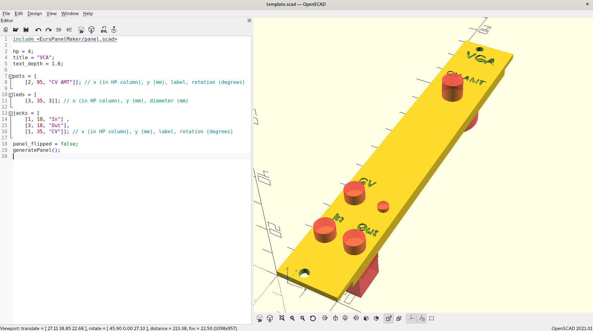
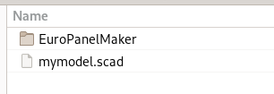
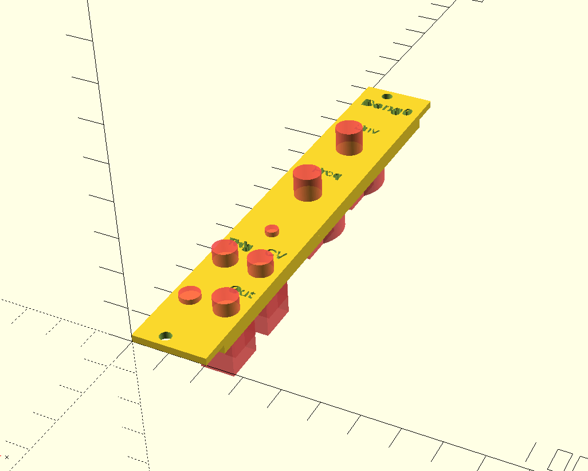
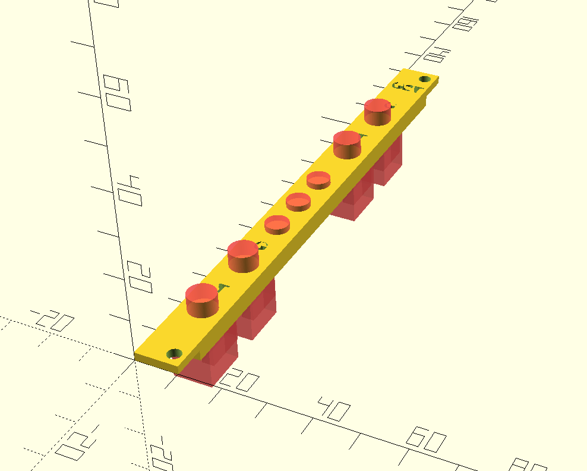
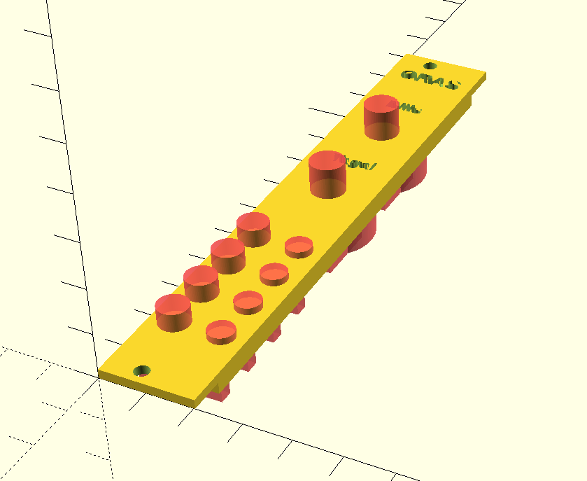
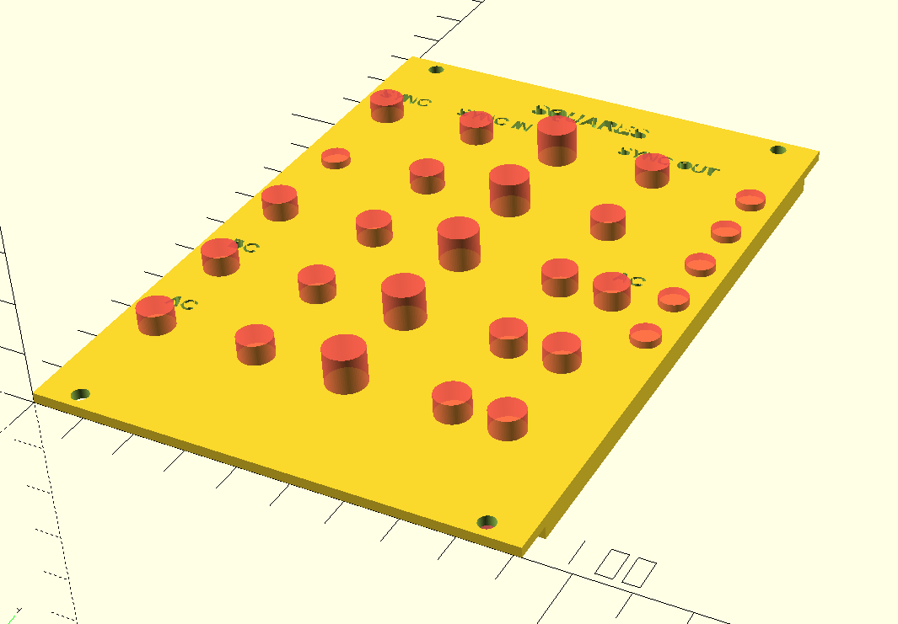
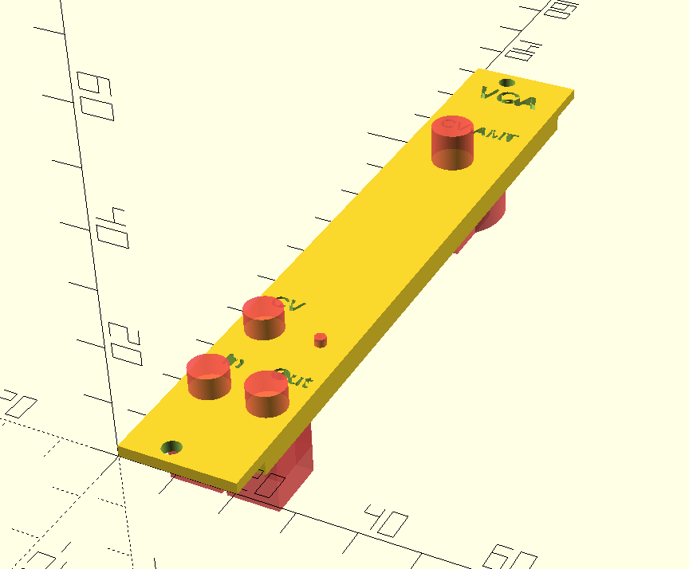
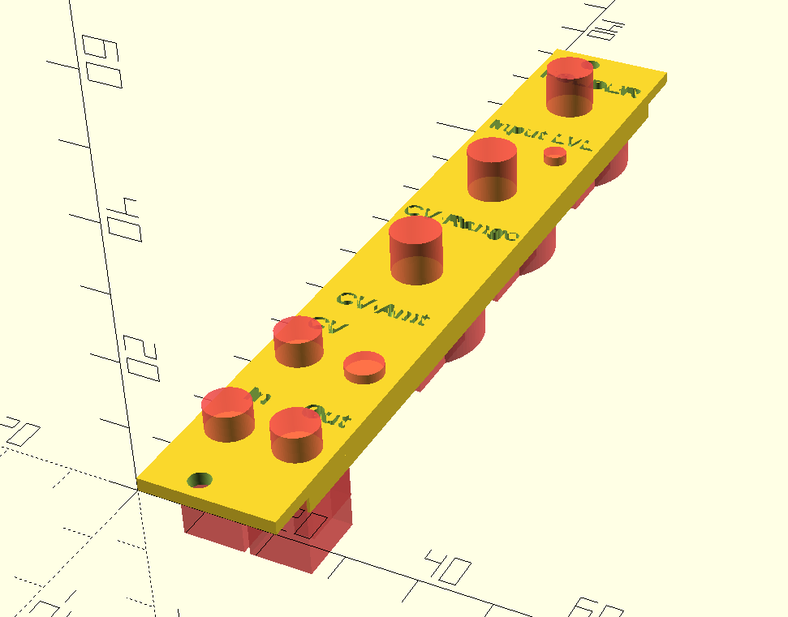
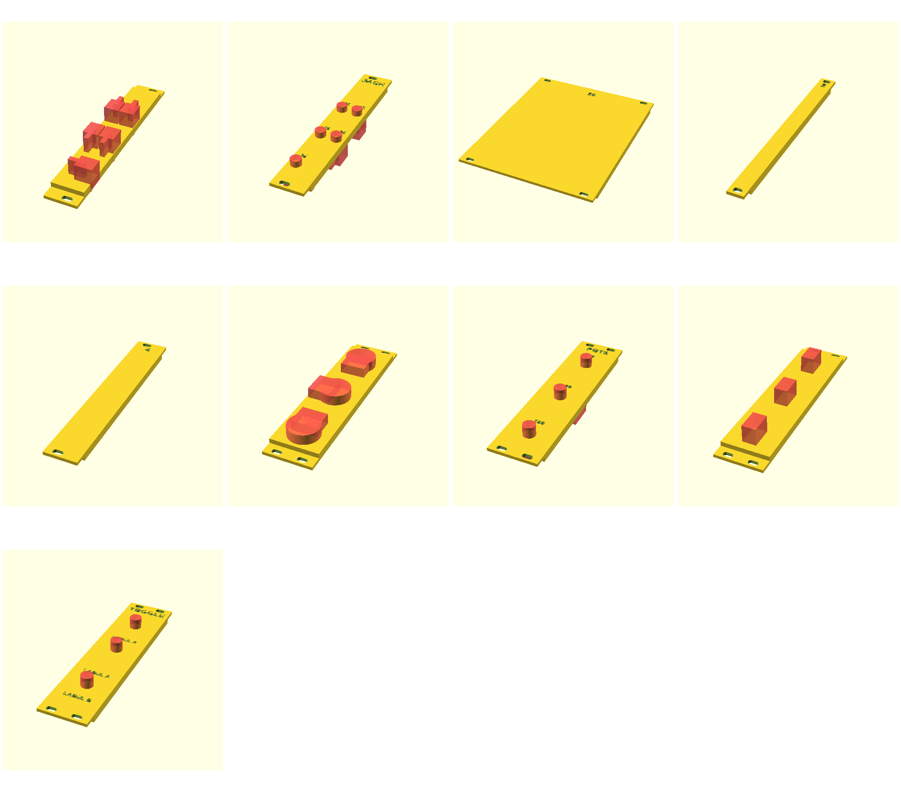

# EuroPanelMaker


Eurorack panel generator for OpenSCAD by [@benjiaomodular](https://www.instagram.com/benjiaomodular/).



I talked about how and why I developed this library on my Youtube channel. Sponsored by [PCBWay](https://pcbway.com)!

[](https://youtu.be/8PgxXPMlfh4)

## How to use

### Installing

Copy the `EuroPanelMaker` folder into your project directory.



### Importing

Include the `panel.scad` file into your project.
```
include <EuroPanelMaker/panel.scad>
```

### Basic Usage

First, define the mandatory variables.
```
hp = 4;
title = "VCA";
```

Then, define any potentiometers, jacks, switches, and LEDs you need.
```
pots = [
    [x (in HP column), y (mm), label, rotation (degrees)]
];

pots_rd901f = [
    [x (in HP column), y (mm), label, rotation (degrees)]
];

jacks = [
    [x (in HP column), y (mm), label, size, rotation (degrees)]
];

// MTS-102
switches = [
    [x (in HP column), y (mm), label above, label below, rotation (degrees)]
];

switches_sr16 = [
    [x (in HP column), y (mm), label, rotation (degrees)]
];

leds = [
    [x (in HP column), y (mm), diameter (mm)]
];

keys = [
    [x (in HP column, y (mm), label)],
];

rectangular_holes = [
    [x, y, inner_width (mm), inner_height (mm), outer_width (mm), outer_height (mm)]
];

speakers = [
    [x (in HP column), y (mm), speaker hole diameter, mount diameter, distance between two opposite screws]
];

circular_holes = [
    [x, y, diameter]
];

spacers = [
    [x, y, size (2, 2.5, 3, 4, 5, 6)]
];
```

Add as many components as necessary in each array. Some notes:

- The rotation parameter on any component can be omitted for no rotation
- The options for jack size is `"35mm"` (for 3.5mm) or `"14in"` (for 1/4 inch) - if omitted, then it will be 3.5mm
- The label below parameter for a switch can be omitted for no label below the switch

Finally, generate the panel.
```
generatePanel();
```
The panel can also be flipped to be exported for printing.
```
panel_flipped = true;
```

### Advanced Usage
A number of variables can be altered. Here is a list with their default values:
```
margin = 0;
text_depth = 1.4;
title_font_size = 4.5;
title_font = "Overpass:style=Bold";
label_font = "Overpass:style=Bold";
label_font_size = 3;
pot_label_distance = 12;
pot_label_font_size = 3;
jack_label_distance = 8;
jack_label_font_size = 3;
toggle_label_distance = 12;
toggle_label_font_size = 3;
key_label_distance = 14;
key_label_font_size = 3;
```

Additionally, extra labels can be added to the panel.
```
labels = [
    [x (in HP column), y (mm), label, rotation (degrees)]
];
```

Each component also has an alternative form where the x-coordinate can be defined by millimeters as opposed to HP. This can be accomplished by adding `_mm` to the end of the component name.

## Examples
You can use `template.scad` as a starting point for your project.

I have included my own panels under `examples/benjiaomodular` for reference. Feel free to add a folder and submit a pull request if you'd like to include your own panels. 

### benjiaomodular
| Name   |      SCAD file      | Preview |
|----------|:-------------:|:------:|
| bong0 | [bong0.scad](examples/benjiaomodular/bong0.scad) |  |
| ce2lfo | [ce2lfo.scad](examples/benjiaomodular/ce2lfo.scad) |  |
| gate2trig | [gate2trig.scad](examples/benjiaomodular/gate2trig.scad) | |
| oras | [oras.scad](examples/benjiaomodular/oras.scad) | |
| squares | [squares.scad](examples/benjiaomodular/squares.scad) | |
| vca | [vca.scad](examples/benjiaomodular/vca.scad) | |
| wavefolder | [wavefolder.scad](examples/benjiaomodular/wavefolder.scad) | |


## Contributing

Some helpful tips for contributing to the EuroPanelMaker library. 

TODO: Add guidelines.

### Visual Tests
A script is available to verify that features of the library are functional. Running `./tests.sh` will generate a set of example panels which will be displayed for visual inspection (tested only on Linux).

A similar image will be displayed:



Look out for misaligned or suspicious renderings. Individual SCAD files are available under `tests/` for further investigation.

NOTE: This will probably be a temporary solution until a more automate testing process is available.
